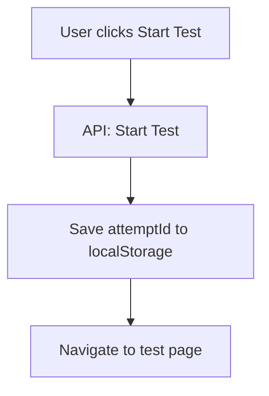
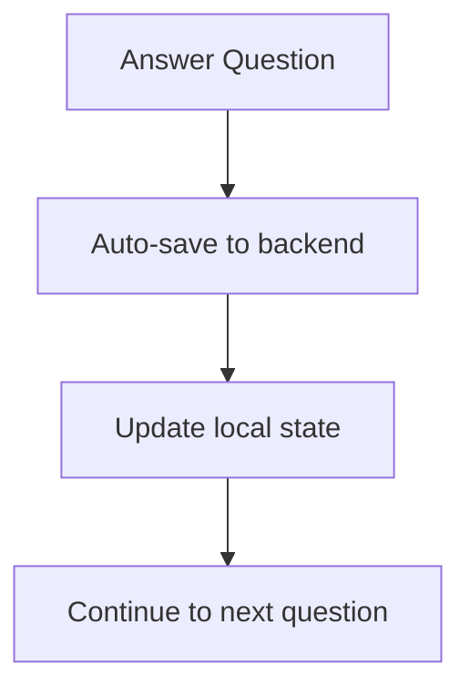
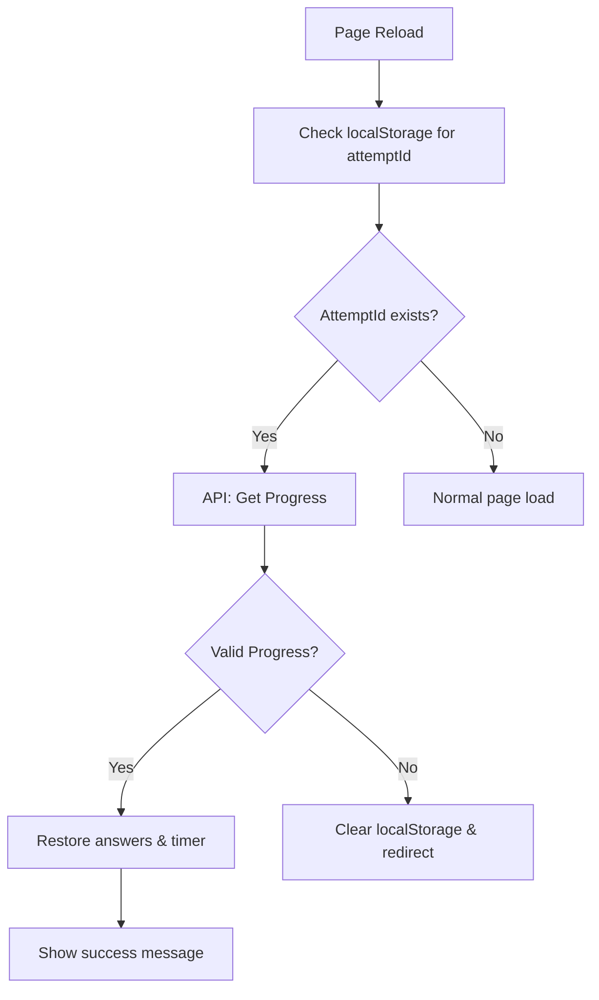
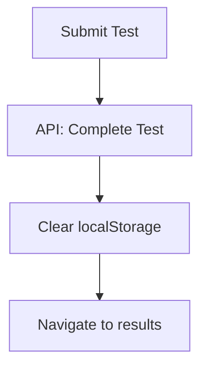

# Test Reload Recovery System

## Overview

This system provides automatic recovery of test progress when users reload the page during an active test attempt. It ensures a seamless testing experience by preserving answers, timer state, and test progress.

## Key Features

### 🔄 **Auto Progress Recovery**

- Automatically detects page reload during active test
- Restores previously selected answers
- Maintains accurate timer countdown
- Preserves current question position

### 💾 **Persistent Storage**

- Uses localStorage to track active attempt IDs
- Survives browser refresh and tab closure
- Automatically cleans up on test completion

### ⚡ **Real-time Validation**

- Checks test expiration status on reload
- Validates attempt status (in_progress, completed, etc.)
- Handles edge cases gracefully

## Architecture

### API Integration

```typescript
// New API endpoint for progress recovery
GET / tests / attempt / { attemptId } / progress;

// Response format
interface TestAttemptProgressDto {
  attemptId: number;
  testId: number;
  testTitle: string;
  status: AttemptStatus;
  startedAt: string;
  duration: number;
  totalQuestions: number;
  answeredCount: number;
  answers: TestAnswerProgressDto[];
  timeRemaining: number;
  isExpired: boolean;
}
```

### Components Updated

- **TestAttemptPage**: Main logic for reload recovery
- **TestsSection**: Saves attemptId when starting test
- **TestHeader**: Updated timer display
- **QuestionCard**: Restored answer selection

### New Utilities

- **testUtils.ts**: localStorage management
- **useTestProgress.ts**: Recovery hook
- **Type definitions**: Progress DTOs

## User Flow

### 1. Starting a Test



### 2. Normal Test Flow



### 3. Reload Recovery



### 4. Test Completion



## Error Handling

### Expired Test

- Shows error modal
- Clears localStorage
- Redirects to course page

### Invalid Attempt

- Logs warning
- Clears localStorage
- Continues normal flow

### Network Errors

- Graceful fallback
- Doesn't block normal functionality
- User can continue testing

## Performance Considerations

### Optimized Loading

- Progress loading shows dedicated spinner
- Parallel API calls when possible
- Minimal re-renders during restoration

### Memory Management

- localStorage cleanup on completion
- React Query caching for efficiency
- Component state optimization

## Security Features

### Data Validation

- Server-side attempt ownership validation
- Time expiration checks
- Status verification

### Storage Management

- Automatic cleanup mechanisms
- Browser storage availability checks
- Error boundary protection

## Usage Examples

### For Developers

#### Starting a Test

```typescript
// Automatically handled in TestsSection
const handleStartTest = async (testId: number) => {
  const response = await startTestMutation.mutateAsync({ testId });
  saveCurrentAttemptId(response.id); // Auto-saved
  router.push(`/test-page`);
};
```

#### Checking Recovery Status

```typescript
// In TestAttemptPage
const { data: progressData, isLoading } = useTestProgress(storedAttemptId);

if (progressData?.isExpired) {
  // Handle expired test
}
```

#### Manual Cleanup

```typescript
// Clear attempt when test is done
clearCurrentAttemptId();
```

### For Users

#### What to Expect

1. **Start Test**: Click start, begin testing normally
2. **Reload Page**: Browser refresh automatically restores progress
3. **Success Message**: "Your previous progress has been restored!"
4. **Continue**: All answers and timer state preserved

#### Limitations

- Only works for in-progress tests
- Requires localStorage enabled
- Timer continues from server time, not paused time

## Testing

### Test Scenarios

1. **Normal Flow**: Start → Answer → Submit
2. **Reload Recovery**: Start → Answer → Reload → Continue
3. **Expired Test**: Start → Wait → Reload → Redirect
4. **Multiple Tabs**: Same test in different tabs
5. **Network Issues**: Offline → Online recovery

### Debugging

```typescript
// Check stored attemptId
console.log('Stored attempt:', getCurrentAttemptId());

// Monitor progress data
console.log('Progress:', progressData);

// Verify localStorage
console.log('LocalStorage available:', isLocalStorageAvailable());
```

## Future Enhancements

### Potential Improvements

- **Offline Support**: Cache questions for offline testing
- **Auto-Save Intervals**: Periodic progress backup
- **Cross-Device Sync**: Continue test on different device
- **Advanced Analytics**: Track reload frequency and patterns

### Configuration Options

- **Recovery Timeout**: How long to keep attemptId
- **Auto-Clear Policy**: When to cleanup storage
- **Fallback Strategies**: Alternative recovery methods

This system ensures a robust, user-friendly testing experience that handles real-world usage patterns gracefully.
